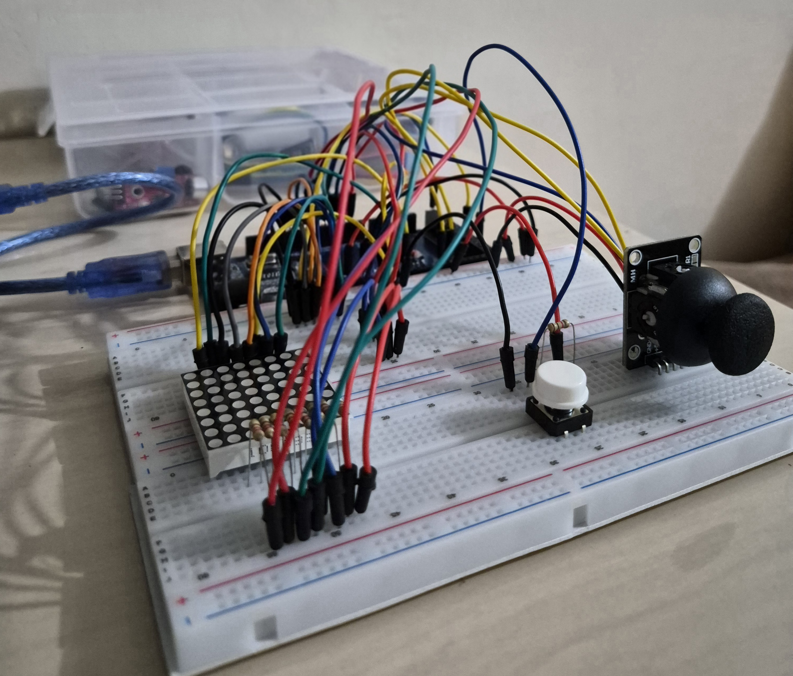
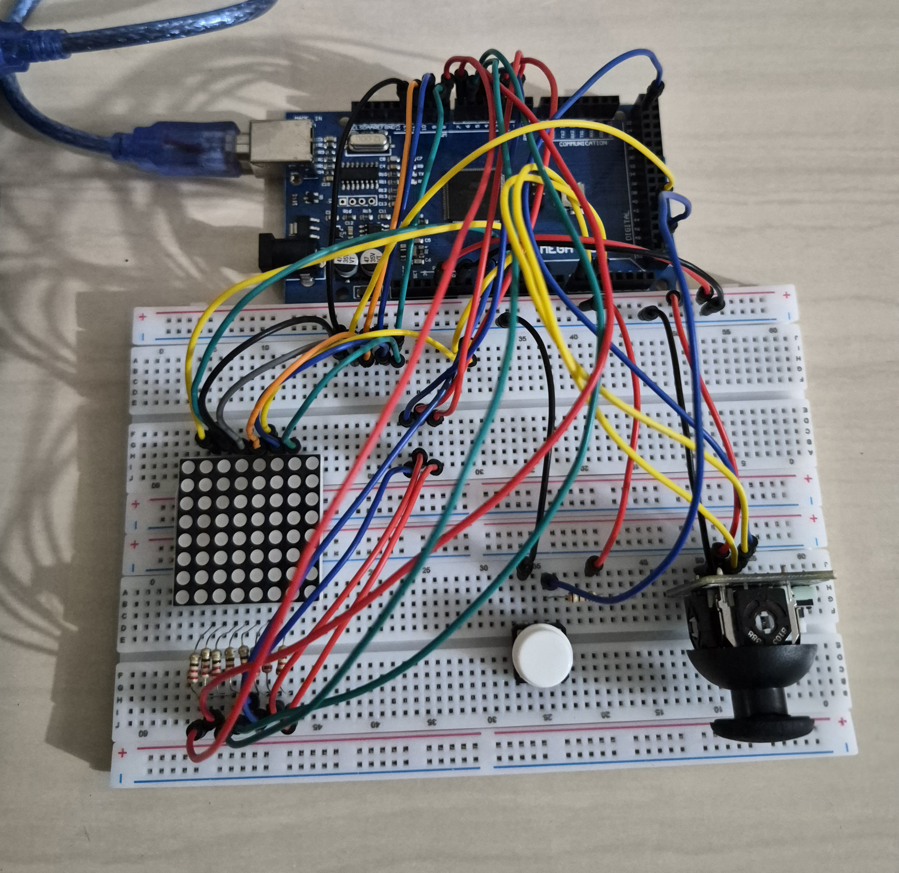

# **Controle de matriz de leds com joystick**

Permite o controle da posição do(s) led(s) aceso(s) na matriz de led 1088BS (8x8) com Arduino (Mega 2560)  utilizando joystick. Além disso, o circuito possui um botão que, quando clicado, altera a condição (aceso/apagado) do led da posição atual. Para apagar todos os leds da matriz, basta segurar o botão por ao menos dois segundos.

**Lógica utilizada:**

* A matriz tela\[8]\[8] armazena as posições dos leds que se manterão acesos.
* Os vetores L\[8] e C\[8] correspondem, respectivamente, aos pinos correspondentes às linhas e colunas da matriz de leds.
* Para o controle do movimento do joystick: os valores variam de 0 a 1023, no estado neutro fica em torno de 512, porém, para evitar movimentos involuntários causados por oscilações, foi considerado o intervalo de 200 a 800.
* desenharMatriz() utiliza multiplexação, percorrendo cada uma das linhas, ligando-as, mantendo os leds necessários acessos (se estiver na posição atual ou na matriz tela\[]\[]) e desligando os demais logo em seguida repetidas vezes com um intervalo de tempo pequeno o suficiente para que não seja percebido.

  
  
  

